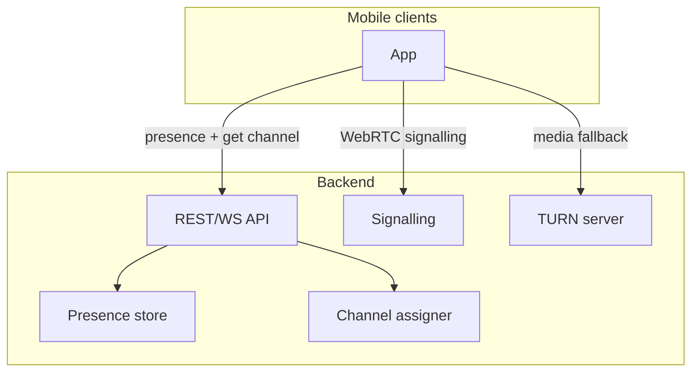

# Plan: Scalable Backend + Real GPS/IMU

This document outlines how to replace the current mocks with (1) a scalable backend for proximity and voice, and (2) real device GPS and IMU on the client.

---

## 1. Current state (what to replace)

| Layer | Current | Interface |
|-------|--------|-----------|
| **API** | [mockApiClient.ts](src/modules/api/mockApiClient.ts) – in-memory presence, cycling channel | `ApiClient`: `updatePresence`, `getAssignedChannel` |
| **Voice** | [mockVoiceModule.ts](src/modules/voice/mockVoiceModule.ts) | `VoiceModule`: init, join/leave channel, mute, state |
| **Location** | [mockLocation.ts](src/modules/location/mockLocation.ts) – synthetic coords/speed | `LocationModule`: start/stop tracking, permissions |
| **IMU** | [mockIMU.ts](src/modules/imu/mockIMU.ts) – synthetic accel/gyro | `IMUModule`: start/stop tracking, permissions |
| **Bluetooth** | [mockBluetooth.ts](src/modules/bluetooth/mockBluetooth.ts) | `BluetoothModule` – keep mock until hardware BLE/headset ready |

Client flow today: [rideSlice](src/state/rideSlice.ts) uses `services.location`, `services.imu`, `services.apiClient`, `services.voice`, and `services.bluetooth`. Swapping implementations in [services.ts](src/modules/services.ts) (and adding a real API client + real voice module) is enough for backend and sensors; BLE can stay mock for now.

---

## 2. Scalable backend architecture

### 2.1 Overview

- **Proximity**: clients send presence (riderId, lat, lon, rideMode); backend stores it and assigns a “channel” (group) for nearby riders. Clients poll or subscribe to get their current channel.
- **Voice**: clients use WebRTC for audio. Backend provides **signalling** (offer/answer/ICE) and optionally **TURN** for NAT. Optionally an **SFU** for multi-party if mesh does not scale.

### 2.2 Proximity service

**Responsibilities**

- Ingest presence: `riderId`, `lat`, `lon`, `rideMode` (`OPEN` | `FRIENDS_ONLY`), `timestamp`.
- Store last position per rider with TTL (e.g. 60–90 s); remove when no update.
- Compute “nearby” and assign a stable **channel id** (e.g. `channel-{geohash}` or `channel-{clusterId}`) for each rider.

**Storage**

- **Option A – Redis**: use [GEOADD](https://redis.io/commands/geoadd) (or a key per rider with lat/lon) and TTL. One key per rider, e.g. `presence:{riderId}` → `{ lat, lon, rideMode, ts }` with expiry. Proximity = GEORADIUS or iterate and compute distance.
- **Option B – PostgreSQL + PostGIS**: store rows per update, query by bounding box or ST_DWithin. Good for analytics and history; can be heavier for high write rate.
- **Recommendation for MVP scale**: Redis (or Redis Cluster) for presence and channel cache. Channel assignment can run in the API process or a small worker.

**Channel assignment**

- **Geohash**: quantise (lat, lon) to a geohash (e.g. precision 5–6). Riders in the same cell share channel id `channel-{geohash}`. Optionally merge adjacent cells if count is low.
- **Distance-based**: for each rider, find riders within R km (e.g. 1–2 km). Form connected components and assign one channel id per component (e.g. smallest riderId or hash of member set).
- **Output**: same interface as today: `getAssignedChannel()` returns `{ channelId: string | null }`. Client continues to poll on an interval (e.g. 5 s) or use WebSocket so server pushes channel changes.

**API shape (keep client contract)**

- `POST /presence` or `PUT /presence` – body: `PresenceUpdate`. Idempotent; server sets TTL.
- `GET /presence/channel` or `GET /riders/me/channel` – returns `{ channelId: string | null }`. Optional: query params for riderId if auth is per-rider.

**Scalability**

- API: stateless; scale horizontally behind a load balancer.
- Redis: single node for MVP; Redis Cluster or managed Redis when needed.
- Optional: region-based deployment (e.g. us-east, eu-west) and route clients to nearest region to reduce latency.

### 2.3 Voice / WebRTC

**Responsibilities**

- **Signalling**: exchange SDP (offer/answer) and ICE candidates so clients can establish peer-to-peer (or client–SFU) connections.
- **Channel model**: one “channel” = one voice group. When the app joins a channel (from proximity), it should join the same WebRTC room/group as other riders in that channel.

**Signalling server**

- WebSocket server (Node.js, or e.g. Socket.IO) per channel or global with `channelId` in messages.
- Messages: `join(channelId)`, `offer`, `answer`, `ice-candidate`. Server broadcasts to others in the same channel.
- Can be the same process as the REST API or a separate service; scale by running multiple instances and using Redis (or similar) to broadcast across instances (e.g. Redis pub/sub per channel).

**TURN**

- Deploy a TURN server (e.g. coturn) for clients that cannot open P2P (symmetric NAT, strict corporate). Same as today’s WebRTC best practice.

**Multi-party**

- **Mesh**: each client has a peer connection to every other in the channel. Fine for 2–4 riders; N*(N-1)/2 connections.
- **SFU** (e.g. mediasoup, Livekit, Janus): clients send one stream to the server; server forwards to others. Scales better for larger groups. Requires a media server and slightly more backend work.
- **Recommendation**: start with mesh + signalling; add SFU when channel sizes or device limits justify it.

**Backend voice API (minimal)**

- WebSocket endpoint (or path) for signalling. Client sends `join`, `offer`, `answer`, `ice`; server echoes to other participants in the same `channelId`.
- Optional REST: `GET /channels/:channelId/token` for TURN credentials or SFU token if you add that later.

### 2.4 Auth and identity

- For MVP, `riderId` can remain client-generated (e.g. UUID or “rider-1234”). Backend trusts it for presence and channel.
- Later: add auth (e.g. JWT or session) and map authenticated user to `riderId`; validate that presence updates and channel requests belong to that user.

---

## 3. Client: real GPS

**Goal**: Implement [LocationModule](src/modules/location/types.ts) using the device’s real location (no mock).

**Options**

1. **React Native Geolocation (built-in)**  
   - `navigator.geolocation` or `@react-native-community/geolocation` (if still used in RN 0.73).  
   - `watchPosition` with `enableHighAccuracy: true` and appropriate `maximumAge`/`timeout` for ride tracking (e.g. 1–2 s updates).  
   - Returns coords; speed and heading may need to be derived from successive positions or may be provided by the API on some platforms.

2. **expo-location**  
   - If you adopt Expo modules: `expo-location` gives a clear API and can request background location on Android.  
   - Fits the same `Location` shape (lat, lon, speedKph, headingDeg) if available or computed.

3. **Native Android module**  
   - Use FusedLocationProviderClient (high accuracy, battery-friendly) and expose a callback to JS.  
   - Needed if you require guaranteed background updates (e.g. foreground service) and full control over frequency.

**Implementation steps**

- Add a real implementation, e.g. `src/modules/location/realLocation.ts` (or `nativeLocation.ts`), that:
  - Requests permissions (same as today).
  - Calls platform location API and maps to `Location` (lat, lon, speedKph, headingDeg).
  - Invokes `onLocation` at the desired interval (e.g. 1–2 s during ride).
- In [services.ts](src/modules/services.ts), switch from `createMockLocationModule()` to the real implementation (e.g. `createRealLocationModule()` or env-based choice).
- **Android background**: if the app must track in background, use a foreground service and keep the same JS interface; the native side (or a library that supports it) handles the service.

**Interface**: unchanged – `startTracking(onLocation)`, `stopTracking()`, `requestPermissions()`.

---

## 4. Client: real IMU

**Goal**: Implement [IMUModule](src/modules/imu/types.ts) using the device’s accelerometer and gyroscope (no mock).

**Why native**

- React Native does not expose raw accelerometer/gyroscope at high rate. For ride analytics you want 50–100+ Hz and stable delivery during ride (including when app is in background or screen off). A **native Android module** is the reliable approach.

**Implementation (Android / Kotlin)**

- In `android/app/src/main/java/...`, create a native module (e.g. `IMUModule`) that:
  - Uses `SensorManager.getDefaultSensor(SENSOR_TYPE_ACCELEROMETER)` and `SENSOR_TYPE_GYROSCOPE`.
  - Registers a `SensorEventListener` with a suitable rate (e.g. `SensorManager.SENSOR_DELAY_GAME` or custom delay for ~50–100 Hz).
  - For each event, builds an object `{ accel: { x, y, z }, gyro: { x, y, z }, timestamp }` (device clock or System.nanoTime()) and sends it to JS via `RCTDeviceEventEmitter` or a callback stored at module init.
- Expose `startIMUTracking`, `stopIMUTracking`, `requestPermissions()` (if needed for sensors; on Android usually no runtime permission for basic IMU).
- **Background**: if the app must record during background, use a foreground service and run the sensor listener in that context so the OS does not throttle it.

**JS interface**

- Keep the same [IMUModule](src/modules/imu/types.ts) and [IMUSample](src/modules/imu/types.ts) shape. In [services.ts](src/modules/services.ts), replace `createMockIMUModule()` with the native module bridge (e.g. `NativeModules.IMUModule` wrapped in an object that matches the interface).

**iOS (later)**

- Same interface; implement with Core Motion (CMMotionManager) and expose to JS via a native module or a library that does so.

---

## 5. Client: real API client and voice

### 5.1 API client

- Add `src/modules/api/apiClient.ts` (or `httpApiClient.ts`):
  - `updatePresence(update)`: `POST` or `PUT` to backend `/presence` with JSON body.
  - `getAssignedChannel()`: `GET` to backend `/presence/channel` (or similar), returns `Promise<{ channelId: string | null }>`.
- Base URL from env or config (e.g. `BACKEND_URL`). Use `fetch` or axios.
- In [services.ts](src/modules/services.ts), use this client instead of `createMockApiClient()` when targeting the real backend (e.g. env flag or build flavour).

### 5.2 Voice module (WebRTC)

- Implement [VoiceModule](src/modules/voice/types.ts) using WebRTC (e.g. `react-native-webrtc` or similar that works with RN 0.73):
  - **init()**: set up WebRTC, maybe get TURN config from backend.
  - **joinChannel(channelId)**: open WebSocket to signalling server, send `join(channelId)`; when others are present, create `RTCPeerConnection`, exchange offer/answer and ICE via signalling; connect audio track (mic) and remote streams to the app’s audio path.
  - **leaveChannel()**: close peer connections, send leave to server.
  - **setLocalMute** / **setGlobalMute**: mute/unmute local track or remote playback; map to `IntercomState` (e.g. OPEN, MUTED_LOCAL, MUTED_GLOBAL) and call `onStateChange` so the UI stays in sync.
- Signalling server URL and (if needed) TURN URLs from config; reuse the same backend or a dedicated WebSocket host.

---

## 6. Rollout and config

- **Feature flag or env**: e.g. `USE_REAL_BACKEND`, `USE_REAL_LOCATION`, `USE_REAL_IMU`. In [services.ts](src/modules/services.ts), choose mock vs real per layer so you can test backend + mock sensors, or real sensors + mock API, etc.
- **Backend URL**: single base URL for REST; separate URL for WebSocket signalling if different.
- Phased rollout: e.g. (1) real location + real API + mock voice/IMU, (2) real IMU, (3) real voice, (4) real BLE when hardware is ready.

---

## 7. File and ownership summary

| Area | Backend | Client |
|------|--------|--------|
| **Proximity** | New service: presence store (Redis) + channel assignment; REST/WS API | Replace mock API client with HTTP/WS client; keep rideSlice usage as-is |
| **Voice** | Signalling (WebSocket) + TURN; optional SFU later | Replace mock VoiceModule with WebRTC implementation using same interface |
| **Location** | — | New real LocationModule impl (RN geolocation or native); swap in services.ts |
| **IMU** | — | New Android (Kotlin) native module implementing IMUModule; swap in services.ts |
| **BLE** | — | Keep mock until hardware; later replace with native BLE module |

No change to the overall app flow or Zustand slices; only the implementations behind `services.*` are swapped for real backend and real device sensors.
